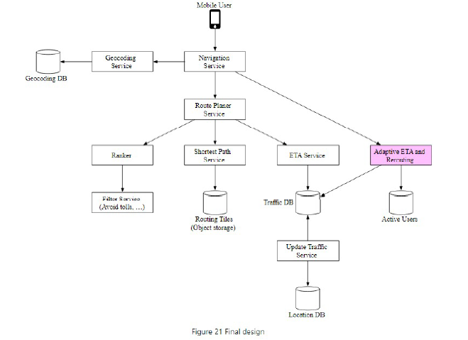

**Design Google Maps**:

**Step 1: Understand the problem and establish design scope**

Features
* Key features? Location update, navigation and ETA
* Road data? TBs of raw data - we already have it
* Traffic? Yes
* Different travel modes? Yes
* Multi-stop? No

Flows
* User-location update
* Navigation service including ETA
* Map rendering

Calculations
* 1bn DAU
* Storage = At zoom level 21 there are 4.3 trillion tiles. If each tile is 256x256 pixels that is 100KB. So 440PB. Can then take 10% as most of the world are forests for 50PB
* Navigation requests = 35 mins per week * 1bn users = 5 bn mins per day. GPS every second results in 300 bn (5 bn minutes x 60) per day, divided by 100k seconds per day is 3m QPS. Can batch requests every 15s for 200k per second with peak 5x is 1m

* Location requests = 

Distributed systems
* Low-latency compute for smooth rendering
* Availability > Consistency

**Step 2: Propose high-level design and get buy-in**

Location service
* Batched write requests to NoSQL database

Navigation service
* Use Djikstra's or A* search for path-finding algorithm
* Need 1. geocoding 2. route planning service (which itself includes shortest path service and ETA service)

Map rendering
* Build map tiles on the fly - huge load
* Pre-generated tiles at each zoom level using geohash and CDN

**Step 3: Design Deep Dive**

Compute
* Computation: Machine learning to predict traffic for ETA service. Adaptive ETA and rerouting involves recursively searching from current location to destination to find routing tile.
* Reliability: Use Kafka for low-latency, high scalability processing of user location data by various services.

Data
* Modelling: graph data as adjacency lists
* Availability: store user data in NoSQL database that can horizontal scale and handle write-heavy loads (commit-log then flushed to disk)
* Low-latency: use CDN for pre-computed world map images
