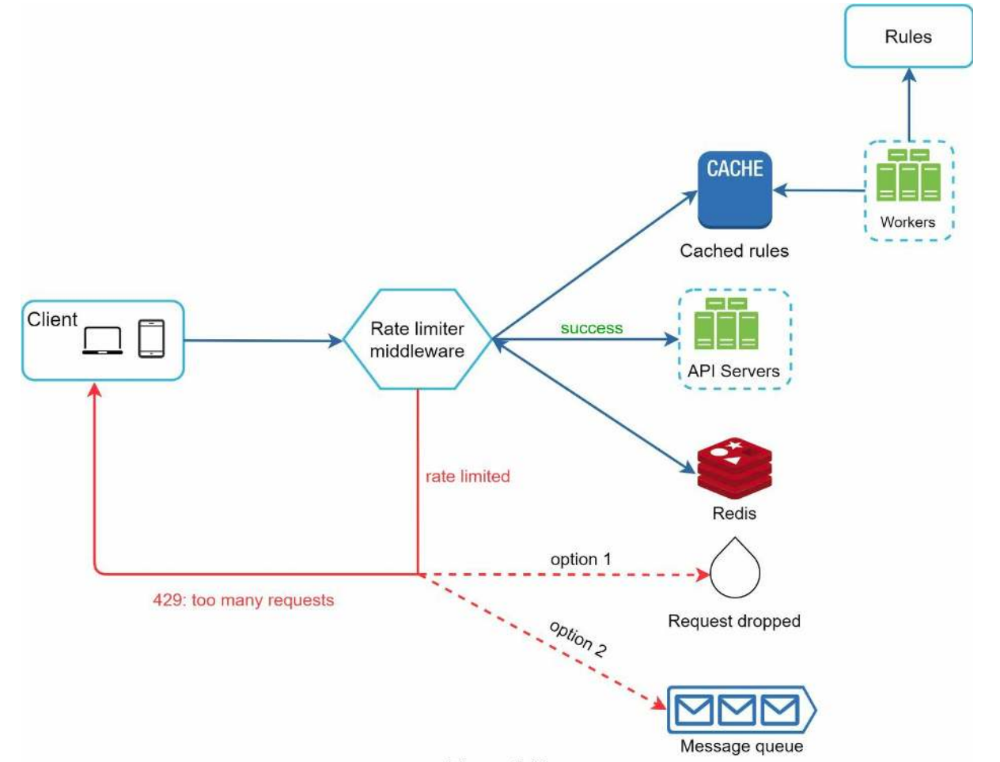

**Design a Rate Limiter**:

**Step 1: Understand the problem and establish design scope**

Definition = a rate limiter is used to control the rate of traffic sent by a client or service

Advantages
* Prevent DoS attack
* Reduce costs
* Prevent server overloading

Questions
* Server side or client side? Typically server as don't have control on client
* Inform throttled users? Yes
* Separate service or as part of app code? Either

**Step 2: Propose high-level design and get buy-in**

Summary: add the rate limiter as middleware with cache for counter

Options
* Where should rate limiter be located? Servers or middleware (API gateway)?
    * Middleware is good as can prevent servers from being notified unless valid request.
* What rate limiting algorithm?
    * Token bucket = Container with pre-defined capacity, tokens are put in bucket periodically until full. Each request tries to request a token, if there is one then the request is made o/w it is dropped. Might need one bucket per IP address or per API endpoint. Allows bursty traffic
    * Leaking bucket = Like token bucket but with a queue for a fixed rate of processing. Disadvantage is old traffic could fill queue and new traffic is dropped.
    * Fixed window counter = fixed window e.g. 1s with a counter per time period. Problem is within a given 1s window you could have 2x the number of requests (i.e. all requests at 0s bunched at 0.9s and all requests at 1s windows at 1.1s)
    * Sliding window log = keeps request of timestamps in memory-cache, for every new request delete outdated timestamps. If log size is less than allowed count accept request otherwise reject. Problem is more memory intensive as have to store timestamps
    * Sliding window counter = combination of fixed window counter and sliding window log where take a rolling percentage based on current timestamp of fixed window counter.
* Database choice?
    * In memory cache where have two operations `INCR` and `EXPIRE`

**Step 3: Design Deep Dive**

Specifics
* Headers = rate limiting comes with specific headers such as `X-Ratelimit-Remaining` with HTTP responses like 429

Architecture
* Database low latency with cache
    * Rules are stored on disk and pull into a cache
    * Redis cache can be used to check in-memory number of tokens etc.
* Compute availability
    * Queue = rather than dropping requests can push to a queue to be processed later.

Problems
* Race conditions = problem is time between reading counter and incrementing counter. Locks are an obvious solution but slow system significantly. Alternative solutions include sorted sets data structure in Redis
* Synchronization = need multiple rate limit servers, but single Redis i.e. being to avoid sticky sessions and sending to same rate limiter with its own cache

Extensions
* Rate limiting by IP address using Iptables. I.e. can go down the OSI model