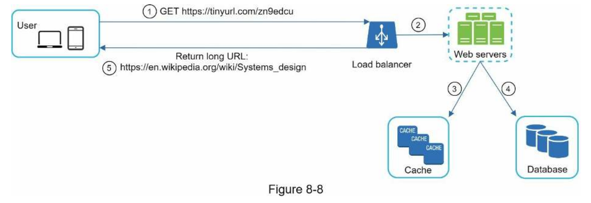

**Design a URL shortener**:

**Step 1: Understand the problem and establish design scope**

Questions
* Example? long url -> tinyurl.com/y7keocwj
* Traffic? 100m / day
* How long shortened URL? As short as possible
* Can they be deleted or updated? No

Calculations
* 10 years * 100 bytes * 365 * 100m / day = 365 billion = 36.5 TB

**Step 2: Propose high-level design and get buy-in**

API endpoints
* `POST api/v1/data/shorten` request includes `longUrl` and returns `shortUrl`
* `GET api/v1/shortUrl` return `longUrl` for redirection
* Trade-off between 301 redirection which is permanent (so it can be cached) and 302 redirection which is temporary so cannot.

**Step 3: Design Deep Dive**

* Hash value length = with `0-9, a-z, A-Z` there are 62 chracters so we need to find the smallest `n` such that `62^n >= 365 billion` where `n=7` should be enough.
* Cannot use default hash algorithm because they produce hash values that are too long
* Collision resolution = just add a new pre-defined character until no longer have a collision but can be expensive to keep looking up or use Base 62 conversion where rebase into new representation of characters though needs unique id generator
* Low-latency : can also add cache and database etc.