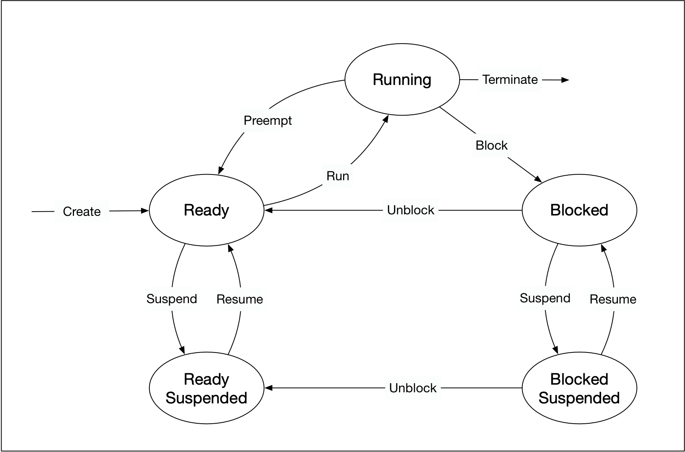
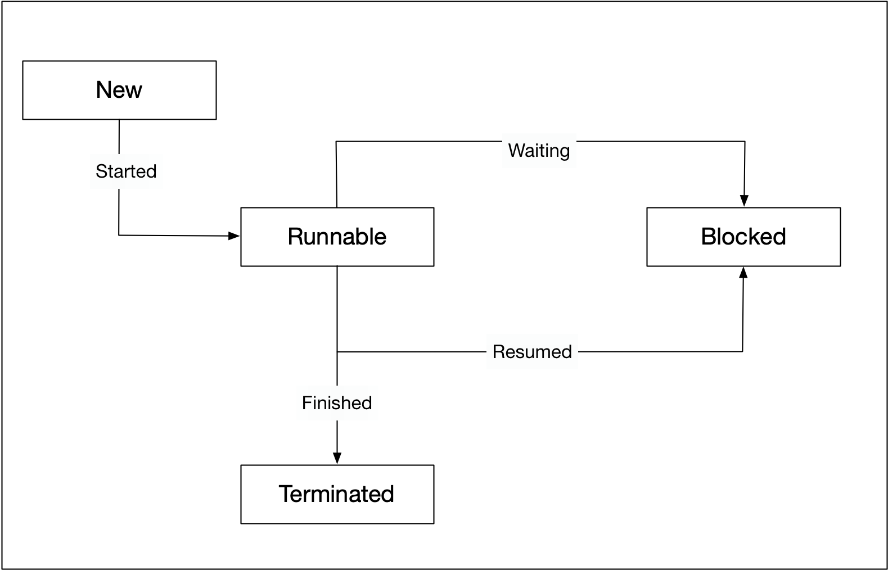

**Threads**

Process = an instance of a program that is operating in the OS with separate memory space and embedded binary code. OS controls process in states

Threads = each process can contain multiple independent, lightweight concurrency units called threads (100x faster to create/destroy than a process) although they share the same memory address space

Goroutines = dynamically sized starting at a few KBs, rather than fixed stack size of 1-2MB for a thread. M:N scheduling of M goroutines on N threads allows for efficient switching. Goroutines yield rather than requiring preemptive context switching. Initially were cooperatively scheduled but could mean never yield back, then in 1.14 added asynchronous preemption after 10ms although only called at safe points at functions calls and loop iterations etc. 

Actors = higher level of abstraction, encapsulated state with message passing, non-blocking operations
Future = a parcel of work, runs on a thread but don't know which. Futures are 1. composable 2. work with callback methods 3. has a return type 4. no guarantee when a thread will be called