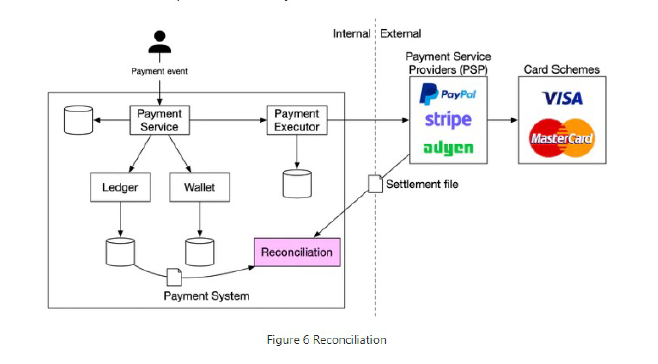
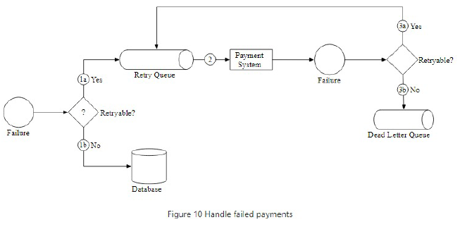

**Design a payment system**:

**Step 1: Understand the problem and establish design scope**

Features
* Kind of payment? Backend for Amazon
* Payment type? Just credit
* Payment processing? No use third-party like Stripe
* Store credit card data? No
* Global? Yes, but only one currency
* Add reconcilation? Yes

Flows
* Buy something
* Pay-out flow to sellers every month

Estimates
* Payment transactions per day? 1m per day
* 10^6 transactions / 10^5 seconds = 10 / second

System Design
* Consistency
* Reliability

**Step 2: Propose high-level design and get buy-in**

Pay-in flow
* First make query to PSP
* Update internal ledger (payment transactions) and wallet (account balance of merchant)

PSP
* If store credit card details can call PSP API
* If don't store then use hosted payments page. 

**Step 3: Design Deep Dive**

Compute
* Concurrency: dedup id is `payment_order_id`. Exactly once is achieved by 
    1. at least once by retry with exponential backoff
    2. at most once by idempotency check and dedup - Payment system sends a nonce so even a separate payment request will be blocked.
* Reliability: retry queue and dead letter queue

Data
* Modelling = Use relational database as limited number of orders & want ACID transactions
* Modelling Use strings for amounts to prevent different protocols and for handling number size