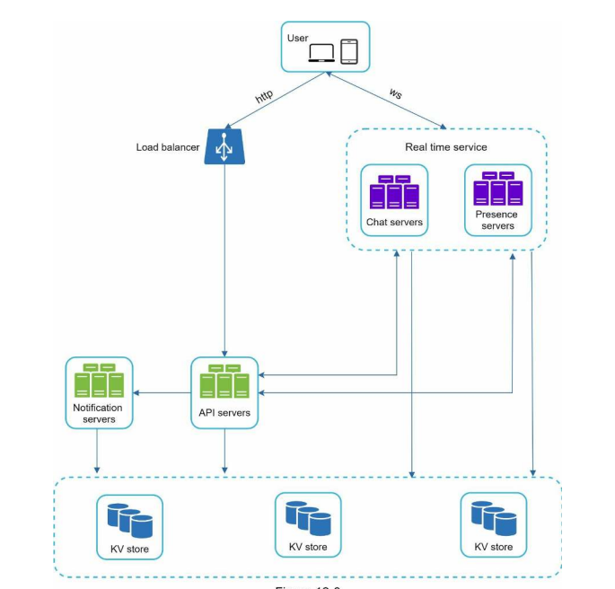

**Design a chat system**:

**Step 1: Understand the problem and establish design scope**

Questions
* 1 on 1 or group based? Both
* Mobile or web? Both
* Scale? 50m DAU
* Group chat limit? Max 100
* Features? 1 on 1 chat, group chat and online indicator. No attachments etc.
* Message size limit? 100,000 characters
* End-to-end encryption? No
* How long store history? Forever

**Step 2: Propose high-level design and get buy-in**

High-level design
* Clients send and receive from a chat service that 1. stores message and 2. relays it
* Two main flows: 1. web-socket for chatting 2. http for everything else like logging in and push notifications third party integrations etc.

Options
* Client initiated vs server initiated: HTTP works fine for sending messages and keep-alive header can be used to allow a client to maintain a persistent connection with the chat service reducing the number of TCP handshakes. Server initiated can be simulated over HTTP with polling, long-polling and WebSocket. Regular polling can be inefficient when most of the time there are no messages. Long-polling involves keeping the connection open until messages are found, but have problems that might long-poll different server from the one the client is connected to. WebSocket is initiated by the client with HTTP but through a handshake upgraded to a persistent connection. Because it is bidirectional typically use it for both sending and receiving although there is a small cost to keeping open the connection.
* Stateless vs stateful = everything is stateless except the chat service itself which has a persistent network connection to a chat server.

**Step 3: Design Deep Dive**

Compute low-latency
* Service discovery with Zookeeper where the best server for the client is selected based upon geographical location, server capacity etc. 

Compute reliability
* Message flows push to a queue where the message is stored in a KV store. Then if online pushed straight to user through web socket connection. If offline push to push notification servers
* Also useful for small group chat flows where push to each inbox - the only downside is you are copying data to multiple queues for each user.

Compute scalability
* Stateless allows multiple servers with data shared amongst them. Not possible for ws connection however as this needs to be stateful

Data availability
* Use key-value store for chat data (although Facebook chat uses CP store HBase)
* Can use heartbeats to establish whether user is online rather than connection status (which might come and go). These can then be pushed to queues for each user's friends etc.

Data consistency
* If have multiple devices with separate connections, each can store local max message id, and if not the same as max from chat server then get it from KV store.

Data Modelling
* Need to generate `channel_id` and `message_id` for composite primary key. NoSQL databases don't have an auto-increment so either need to use a global number generator or use a local sequence number generator (latter is sufficient as have `channel_id`)

Data Security
* Whatsapp uses end-to-end encryption so only clients can read the messages.