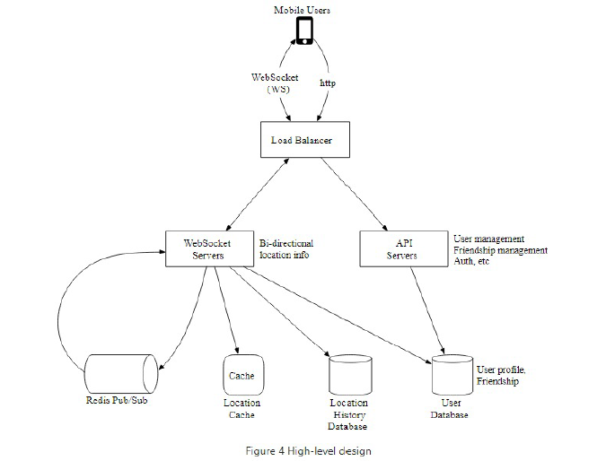

**Design Nearby Friends**:

**Step 1: Understand the problem and establish design scope**

Features
* Users can move? Yes - big difference to proximity service
* Fixed radii? No, configurable.
* Store location history? Yes
* Inactive friend show last no known location? No just don't show.
* Privacy laws? No

Flows
* Sending your location
* Receiving friends locations
* Misc API calls

Per unit

Aggregate
* Number of users? 1bn and 10% use feature so 100m DAU
* Peak concurrent users 10% of 100m = 10m
* Query update every 30s so 10m / 30 = 334,000 QPS

Distributed Systems
* Low-latency: should have rapid updates
* Reliability: occasional data-loss is acceptable
* Consistency: eventual consistency is fine

**Step 2: Propose high-level design and get buy-in**

Approaches
* Peer-to-peer but flaky connections and tight power consumption - too expensive
* Shared backend with pushed updates -> if 334K QPS with 400 friends and 10% online that is 14m location updates per second

Overall design
* Two flows 1. web-socket for bi-directional location info 2. API servers for auth, user management, friendship management etc.
* Redis used for location data - one data point per user -  and cheap pub/sub

**Step 3: Design Deep Dive**

Compute
* Low-latency: use websockets for connections - be careful draining nodes in load balancer
* Scalability: load-balancer 
* Scalability: service discovery to 1. keep list of servers where key is pub sub ring and value is the servers 2. ability to subscribe to a particular server e.g. etcd or zookeeper
* Reliability: Redis pub/sub server is very lightweight. A channel only requires a hash table and a linked list to keep track of subscribers. Pub/sub should use consistent hashing to manage servers as CPU not memory is likely to be bottleneck. Scaling is painful, but replacing failed server not so much as less data transfer

Data
* Scalability: shard the user data
* Low-latency: also shard the redis cache data - 334k/s is too much for one server
