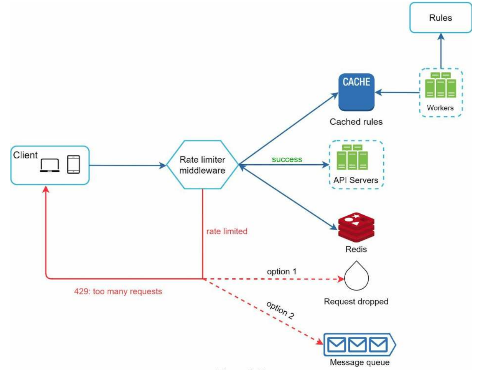

**Design Nearby Friends**:

**Step 1: Understand the problem and establish design scope**

Features
* Users can move? Yes - big difference to proximity service
* Fixed radii? No, configurable.
* Store location history? Yes
* Inactive friend show last no known location? No just don't show.
* Privacy laws? No

Flows

Per unit

Aggregate
* Number of users? 1bn and 10% use feature

Distributed Systems

**Step 2: Propose high-level design and get buy-in**

**Step 3: Design Deep Dive**

