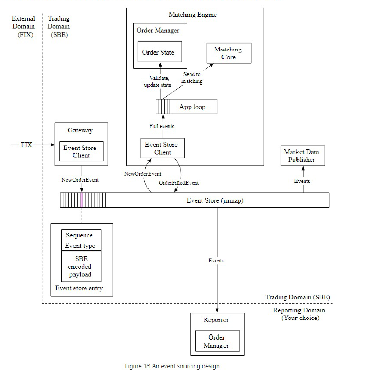

**Design a stock exchange**:

**Step 1: Understand the problem and establish design scope**

Features
* Trade what? Stocks
* After hours trading? No
* Regulated? Yes so need risk checks e.g. max 1m shares Apple stock in one day
* Check have sufficient amount of money in wallet

Flow
* Place a new limit order
* Cancel a limit order
* View real-time order book (list or buy and sell orders)

Estimates
* 10k concurrent users
* 100 symbols
* Billions of orders a day

System Design
* 2 9s availability
* Round-trip latency as ms level.
* QPS = 1bn orders / 6.5 hours x 3600 = ~43k. Peak QPS ~250k

Financial context
* Limit order = buy or sell order with a fixed price. Might not be matched immediately or it might just be partially matched.

**Step 2: Propose high-level design and get buy-in**

**Step 3: Design Deep Dive**

Compute
* Concurrency: Sequencer in matching engine makes it deterministic as every incoming order is given a sequence ID. 
* Low-latency = latency = number of tasks on critical path and time spent on each task. Can do this by having application loop 1. no context switching and 2. no locks and no lock contention as single threaded

Data
* Availabiity: Hve backup instances of matching engine etc. and switch to them fast. 
* Low-latency: use a doubly linked list with hash map for O(1) add and cancel orders. Rather than network or disk latency communicate via mmap. Ring buffers are efficient space usage with no allocation or de-allocation and the data structure is lock free. 