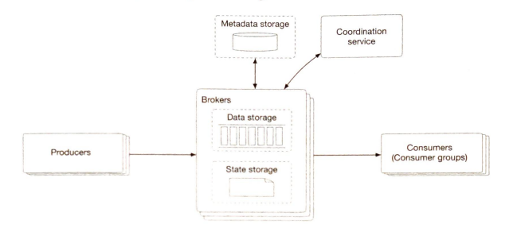

**Design a distributed message queue**:

**Step 1: Understand the problem and establish design scope**

Questions

Features: Event streaming (above message queue)
* Repeatedly consumed? Yes
* Same order? Yes
* Data persistence? Yes for two weeks?

Compute
* Number of producers & consumers? As many as possible
* Delivery semantic? At most once, at least once or exactly once.  

**Step 2: Propose high-level design and get buy-in**

Architecture: Producer, message queue and consumer

Choices:
* Point-to-point: each message consumed by one consumer vs Publish and subscribe: Multiple consumers with a topic
* Push vs pull consumer model

Architecture

**Step 3: Design Deep Dive**

Compute
* Scalability: Partition (sharding) where offset is position in partition (maintaining order within partition but not across)
* Scalability: Brokers act like load balancers to distribute data across partitions
* Scalability: Consumer group subscribes to a topic, distributing partitions across them. In order to maintain ordering we have one consumer for each partition. To rebalance need broker with leadership elections and heartbeats etc.
* Reliability: Consumer pull model better than push so consumers aren't overwhelmed and can batch more easily.
* Throughput: Batch data (trade-off is higher latency) from brokers to network request etc.

Data
* Consistency: offsets track where consumers have consumed in each partition. If a consumer fails the state data tracks where it got up to. One option is to move metadata, state storage and coordination service to ZooKeeper. Different options for how consistent in-sync replicas need to be include ACK=all, ACK=1 and ACK=0
* Scalability: Need write-heavy and read-heavy so Write-ahead logs are preferred to NoSQL databases. 
* Low-latency: Persistence on disk is fast as long as it is sequential not random access. Modern systems also cache aggressively
* Modelling: Eliminate expensive copying by having single schema for producer, queue and consumer
* Availability: Need in-sync replicas to provider availability
