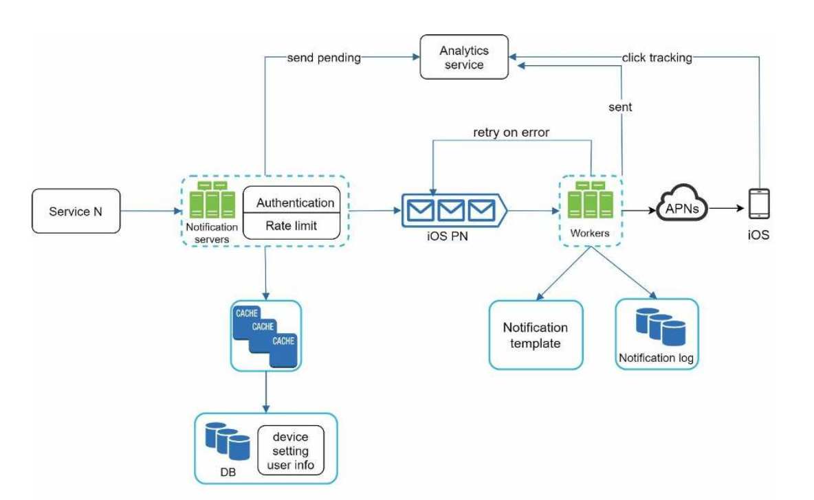

**Design a notification system**:

**Step 1: Understand the problem and establish design scope**

Questions
* What types of notifications? Push, SMS & email
* Real-time? Soft real-time - i.e. asap
* Can users opt-out? Yes
* Numbers? 10m mobile push, 1m SMS, 5m emails

**Step 2: Propose high-level design and get buy-in**

Summary: Use queues to add reliability and politeness

Push providers
* IOS: Apple Push Notification Service (APNS)
* Android: Firebase Cloud Messaging (FCM)
* SMS: Twilio & Nexmo
* Email: Sendgrid & Mailchimp

**Step 3: Design Deep Dive**

Compute Reliability
* multiple notification servers to avoid SPOF
* add queues with retry to each service - even with deduplication we cannot have exactly once delivery however as might have a network error either choose at least once or at most once.
* add notification append only log

Compute Scalability
* multiple servers to computer and push to service providers
* autoscaling of servers

Compute Low Latency
* Notification templates

Data Low Latency
* add cache to database of user info

Data Security
* only authenticated users allowed to push

