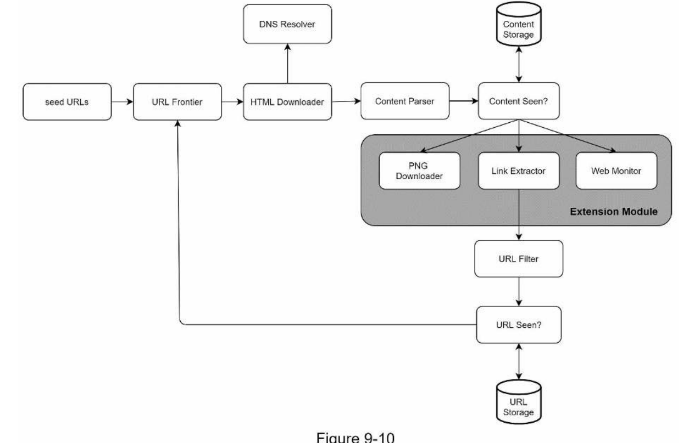
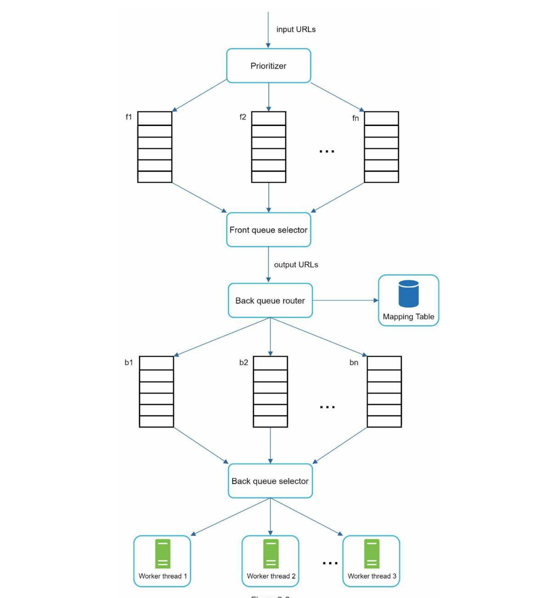

**Design a web crawler**:

**Step 1: Understand the problem and establish design scope**

Definition = Recursively extract URLs from web pages, go to those sites and download them and extract more links.

Questions?
* What is the purpose?
    * Search engine indexing
    * Web archiving
    * Web mining
    * Web monitoring
* Newly edited pages? Yes, but ignore duplicate content
* How many web pages per month? 1 billion
* Keep for how long? 5 years
* What type of content? HTML only?

Back-of-envelope
* 1 billion per month -> 400 pages per second, so peak is 800 pages per second
* Average web page size is 500k -> 1 billion pages is 500 TB storage per month
* Storage 500TB * 12 months * 5 years = 30 PB

**Step 2: Propose high-level design and get buy-in**

Approach
* BFS with a queue and visited field
* Visited check for 1. content 2. URL
* Web specifics include HTML downloader, DNS resolver, link extractor etc. 

**Step 3: Design Deep Dive**

Compute
* `robots.txt` says which urls are allowed and which are not

BFS with queue
* Multiple queues with different priorities -> randomly pick from a queue but with higher probability for more important queues

Availability
* Politeness involves not spamming a particular website i.e. thinking about their availability moderating demand with a queue

Low-latency
* Use buffered write to disk with cache for low-latency and scalability of URLs, DNS resolver etc.
* Distribute crawlers geographically
* Quick timeout if server doesn't respond

Scalability
* Check for duplicates in data using hashsums
* Check for infinite loops with some rule if too deep recursion etc. spider traps
