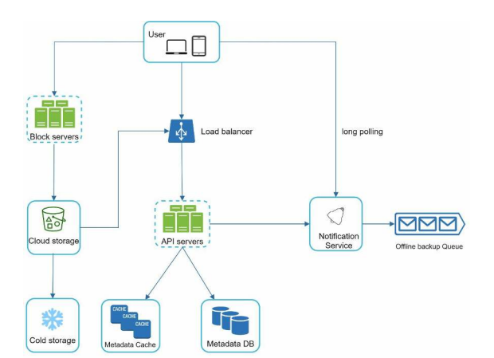

**Design Google Drive**:

**Step 1: Understand the problem and establish design scope**

Questions
* Features? Upload & download files, file sync and notifications
* Clients? Mobile app and web app
* File formats Any
* Encryption? Yes
* File size limit? Yes 10GB or smaller
* Scale? 10m DAU.

Calculations
* 50m users with 10m DAU each with 10GB free space
* 2 uploads per day, 500KB each with 1:1 read-write ratio
* 50m * 10GB = 500PB
* QPS: 1m * 2 / 24 / 3600 = 240 with peak at 480

**Step 2: Propose high-level design and get buy-in**

APIS: Upload, download and get file revisions

**Step 3: Design Deep Dive**

Compute reliability
* Notification pub/sub service used for notifying clients of events
* Offline backup queue for when client isn't online

Compute scalability
* Load balancer with multiple servers

Data availability
* Amazon S3 has replication in the same-region and cross-region
* Replicate metadata to prevent SPOF

Data consistency
* Sync conflicts - either go to earlier version wins or latest version wins or merge or let user choose.
* For consistency need ACID transactions in order to invalidate caches if not consistent with database so use relational database as NoSQL do not support
* Use long-polling rather than web-sockets to keep data in sync with push notifications

Data low-latency
* Metadata cache for fast retrieval

Data scalability
* Sharding by `user_id`
* Break file into blocks and upload them independently. Use delta-sync and compression. 
* Cold storage is a cheap way to store infrequently accessed data

Data security 
* Encrypt before sending to cloud storage