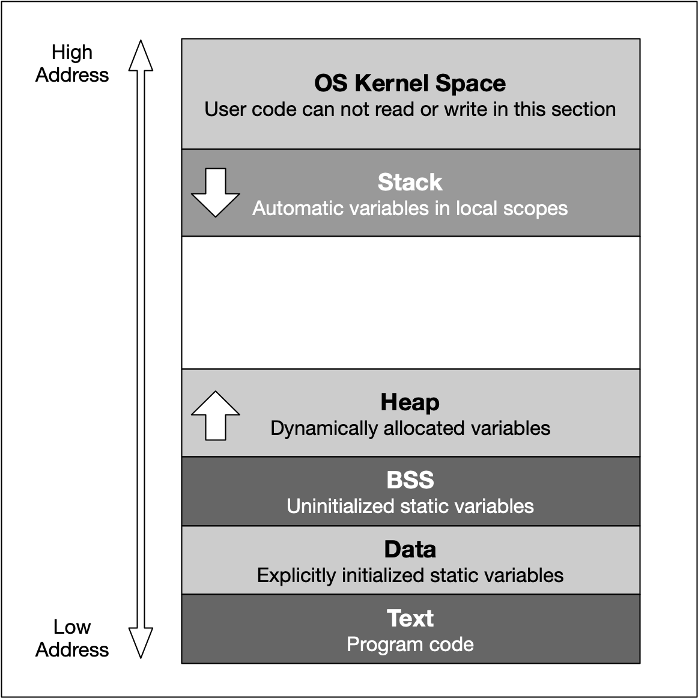

**Heap**

**Definition**
* Also known as free store in C++ is where dynamic storage lives. It is shared among multiple threds in a program and needs to be explicitly freed by the programmer. This is where dynamic memory allocation occurs.

**Commands**
* `malloc`: From C stands for memory allocation (`calloc` is cleared memory allocation where all bits set to 0)
* `new`: From C++
* `free`: From C
* `delete`: From C++
* handles: Does the new and delete for you.

**Problems**
* Memory fragmentation

