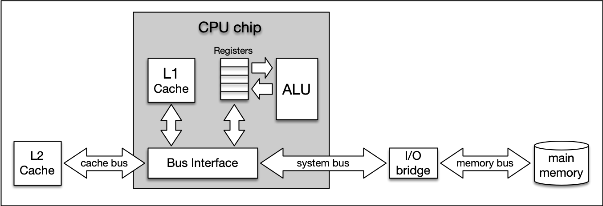
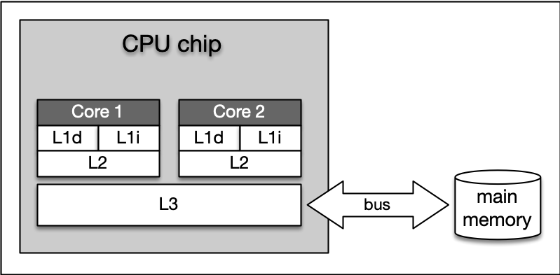

**Cache**: enables low-latency data access.

**How it works**: temporary storage area that stores the result of expensive responses or frequently accessed data in memory so that subsequent requests are served more quickly.

What happens if it fails?
* It is a single point of failure, could have multiple caches
* Consistency is difficult as cache and database is not a single transaction - typically want either 2-phase commit or compensating transaction. Scaling across multiple regions is even more difficult

Caching strategies
* Cache-aside (lazy loading) = application code is responsible for loading into cache, invalidating stale entries and retrieving data etc. 
* Read-through = cache is responsible for loading data from the primary data store. When a cache miss occurs the cache itself fetches the missing data, stores it, and then returns it to the requester
* Write-through = every write operation to the cache is immediately mirrored to the primary data store this can provide strong consistency between cache and database but write operations have higher latency
* Write-back = write operations are directed to cache with periodic write behinds to the database (there is a risk of data loss before database write however)

Best suited
* Best suited for data that is read a lot but with limited modifications

Options:
* Caching strategy: read-through where if can access data in cache returns, otherwise queries database and stores in cache.
* Expiration policy: too stale vs too much reloading from database
* Eviction policy: LRU, LFU, FIFO
* External caches such as content delivery networks CDNs for static assets although cost, cache expiry and CDN fallback considerations

Types of cache
* Level 1 cache is the fastest and smallest memory type in the cache hierarchy. In most systems, the L1 cache is not very large. Mostly it is in the range of 16 to 64 kBytes, where the memory areas for instructions and data are separated from each other (L1i and L1d, where "i" stands for "instruction" and "d" stands for "data". Also see "Harvard architecture(opens in a new tab)" for further reference). The importance of the L1 cache grows with increasing speed of the CPU. In the L1 cache, the most frequently required instructions and data are buffered so that as few accesses as possible to the slow main memory are required. This cache avoids delays in data transmission and helps to make optimum use of the CPU's capacity.
* Level 2 cache is located close to the CPU and has a direct connection to it. The information exchange between L2 cache and CPU is managed by the L2 controller on the computer main board. The size of the L2 cache is usually at or below 2 megabytes. On modern multi-core processors, the L2 cache is often located within the CPU itself. The choice between a processor with more clock speed or a larger L2 cache can be answered as follows: With a higher clock speed, individual programs run faster, especially those with high computing requirements. As soon as several programs run simultaneously, a larger cache is advantageous. Usually normal desktop computers with a processor that has a large cache are better served than with a processor that has a high clock rate.
* Level 3 cache is shared among all cores of a multicore processor. With the L3 cache, the cache coherence(opens in a new tab) protocol of multicore processors can work much faster. This protocol compares the caches of all cores to maintain data consistency so that all processors have access to the same data at the same time. The L3 cache therefore has less the function of a cache, but is intended to simplify and accelerate the cache coherence protocol and the data exchange between the cores.

Orders of magnitude
* L1 time for photon to travel 1 ft, L2 is 10x, main memory 1000x L1