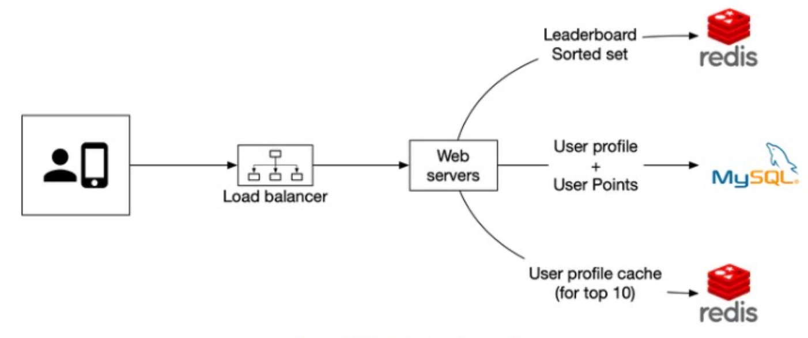
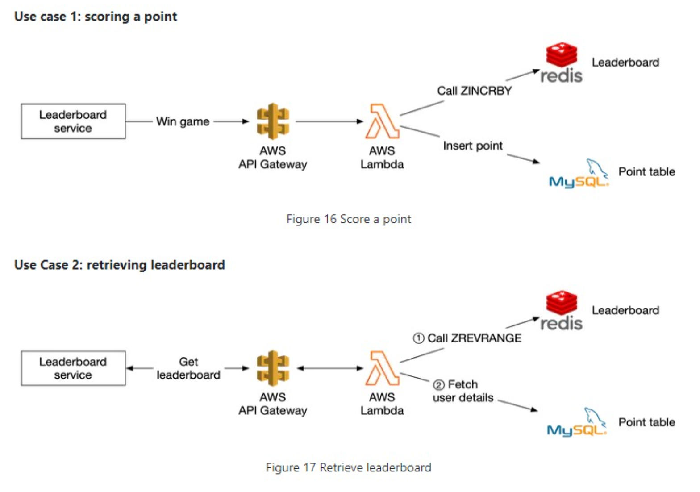

**Design a real-time gaming leaderboard**:

**Step 1: Understand the problem and establish design scope**

Features
* How score calculated? Add one point for a win
* All players on leaderboard? Yes
* Time segment to leaderboard? New board each month
* Just top 10 user? Yes but also your position
* Same score? Same rank
* Real-time? As close to real-time as possible

Flows

Estimates
* DAU 5m 
* QPS = 5m / 100k seconds = 50 QPS - but peak is probably 5x at 250 QPS. But 10 games per user so 2500 QPS 
* MAU 25m
* Matches played per day? 10

System Design
* Low-latency is key

**Step 2: Propose high-level design and get buy-in**

Flow
* Win a game -> Score is updated
* Get leaderboard/player rank -> query score database

Approaches
* SQL approach but doesn't scale because rank operation is too slow
* Redis = use sorted sets which are implemented as a hash table (i.e. user -> score) and a skip list (i.e. score -> user). Increment score by X is O(log n) operation. Top 10 leaderboards is just O(m) for m = 10. And user's leaderboard position is O(1) from hash 
* NoSQL = need to partition on user id and have secondary index by score

**Step 3: Design Deep Dive**

Use Cloud
* Amazon API Gateway = define HTTP endpoints of a RESTful API and connect it to any backend services
* AWS lambda functions = run code without having to provision or manage the servers ourselves. 

Data
* Scalability: Redis can handle QPS and storage but if we scale up traffic can shard data either on fixed or hash partitions. Fixed partitions are better as low-latency performance on top-10 where shard by score (only complication is shifting between partiitons when score changes)
