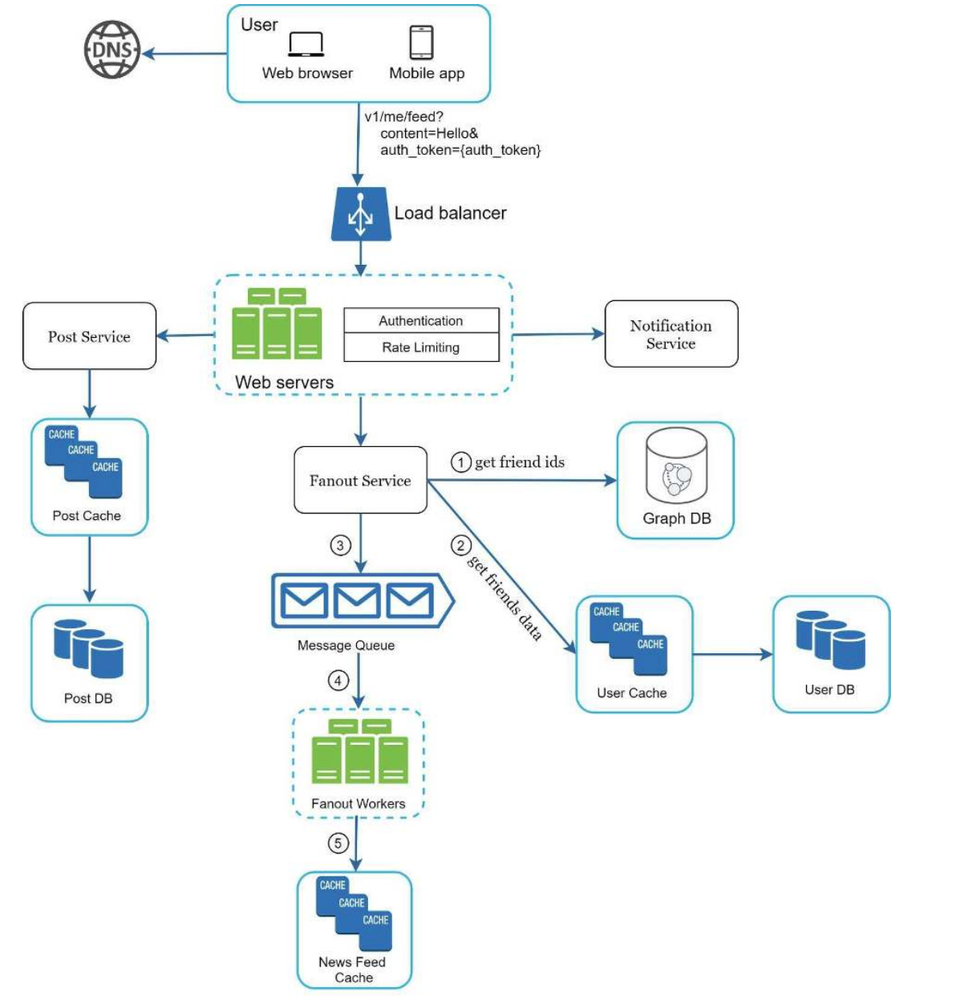
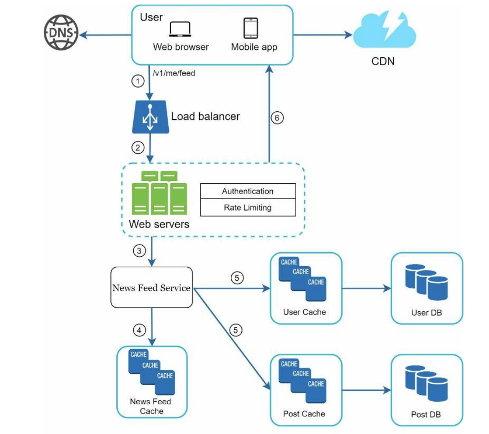

**Design a news feed system**:

**Step 1: Understand the problem and establish design scope**

Questions
* Technologies? Mobile and app
* Ordering of news feed? reverse chronological
* Volume? 10m DAU
* Types of content? Image, video and text

**Step 2: Propose high-level design and get buy-in**

Summary: Cache as much as possible

Two main flows
* News feed publishing: `POST /v1/me/feed` with content and `auth_token` arguments
* News feed retrieval: `GET /v1/me/feed` with `auth_token` argument

**Step 3: Design Deep Dive**

Compute reliability
* Message queue
* Rate limiting

Compute scalability
* Load balancer and multiple web servers
* Fanout workers

Data availability
* Replication of databases

Data low latency
* Persist in database and cache for post and fanout service
* Pre-compute and push to cache on write rather than on read. Trade-off can be for celebrities only pull data otherwise can overwhelm system.

Data modelling
* Graph database for social graph

Data security
* Only allow authenticated users to access.

Compute reliability
* Rate limiting

Compute scalability
* Load balancer and multiple web servers

Data availability
* Replicate databse

Data low latency
* Retrieve from CDN - serverless
* Retrieve from cache

Data security
* Only allow authenticated users to access.