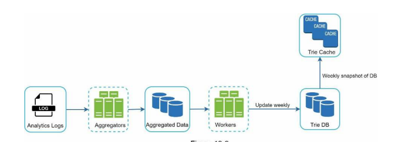

**Design a search autocomplete**:

**Step 1: Understand the problem and establish design scope**

Questions:
* Match on beginning or middle? Only beginning
* Number autocomplete suggestions? 5
* How choose which 5? Based upon popularity
* Spell check? No
* English only? Yes
* Capitalization and special characters? No
* Scale? 10m DAU

Calculations
* 10m DAU, average person 10 searches per day, 20 bytes of data per query string (1 character 1 byte and 4 words with 5 characters) with 20 requests sent per search
* 24k/second = 10m * 10/day * 20 characters / 24 / 3600. Assume peak is 2x i.e. 48k
* 20% of queries are new so 0.4GB per day = 10m users * 10 queries / day * 20 byte storage * 20%

**Step 2: Propose high-level design and get buy-in**

Main flows
* Data gathering = frequency table
* Query service = sort by frequency 

**Step 3: Design Deep Dive**

Compute low-latency
* AJAX requests avoid reloading the entire webpage

Compute scalability
* Batching is helpful 1. constantly re-calculating and 2. trie is unlikely to change that much. Could process once a week.

Data low latency
* Can improve with a trie cache
* Can also cache in the browser

Data modelling
* Use a trie data structure - modified to include frequencies. Find the prefix `O(p)`, traverse the subtree to get all valid children `O(c)` and sort to get top `k` `O(c logc)`. Problem is too slow so can limit max length of prefix.
* May want an additional filter on hate/porn etc.

Data scalability
* Can sample data rather than modelling everything
* Can shard data 