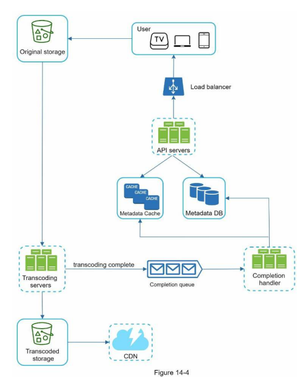
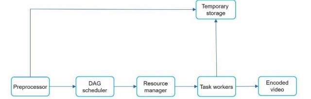

**Design YouTube**:

**Step 1: Understand the problem and establish design scope**

Questions
* Features? Upload & play video
* Clients? Mobile, web browsers & smart TVs
* DaU? 5m
* Daily average time? 30 mins
* International? Yes
* Video resolutions? All common
* Encryption? Yes
* File size? Max 1GB
* Leverage existing cloud? Yes

Calculations
* 5m DAU watching 5 videos per day
* 10% users upload 1 video per day, average video size is 300MB so 150TB = 5m * 10% * 300MB
* CDN cost = $0.02/GB so 150TB * $0.02 = $150k per day

**Step 2: Propose high-level design and get buy-in**

Two types of request
* Streaming video via CDN
* Everything else via API servers

Two flows
* Video uploading
* Video streaming

**Step 3: Design Deep Dive**

Video uploading
* Transcoding is the process of converting a file from one format to another. There is the container which is `.avi`, `.mov` or `.mp4` and then there is the code which is the compression and decompression algorithm such as `H.264`, `VP9` or `HEVC`
* Transcoding architecture - key idea is need to encode into 1. multiple formats 2. multiple parts e.g. audio, video, metadata, thumbnail etc. which can be done in parallel using task scheduler and queues etc.

Video streaming
* Streaming protocols include Moving Picture Experts Group Dynamic Adaptive Streaming over HTTP (MPEG-DASH), Apple HTTP Live Streaming (HLS), Microsoft Smooth Streaming and Adobe HTTP Dynamic Streaming (HDS)

Compute reliability
* Message queues between every step

Data low latency
* Upload to and stream from nearest CDN for low latency
* Only upload most popular videos to CDN o/w use own servers.

Data scalability
* Parallelize uploading in chunks

Data security
* Only authorized users can upload by using pre-signed URLs which gives access permission to the object identified in the URL
* Copyright protection using Digital rights management (DRM), AES encryption and Visual watermarking
