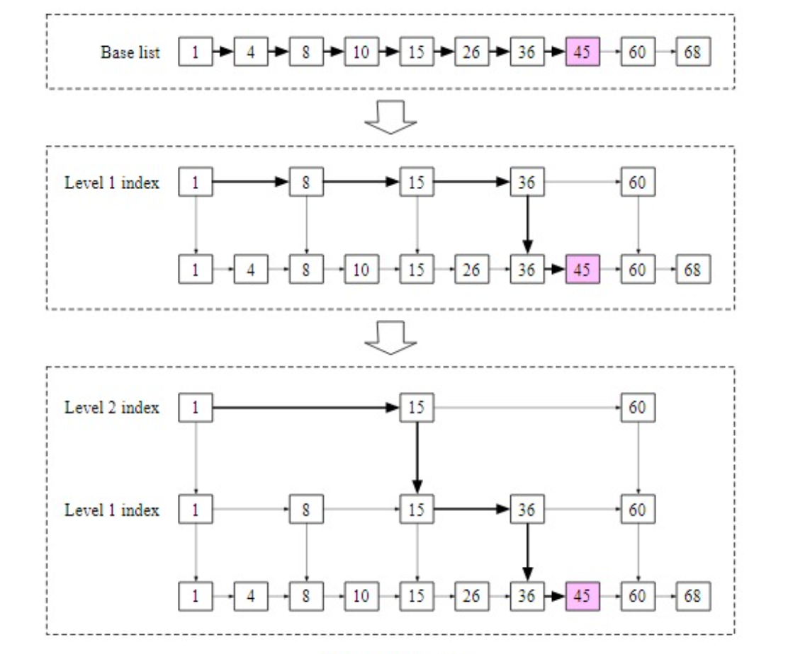
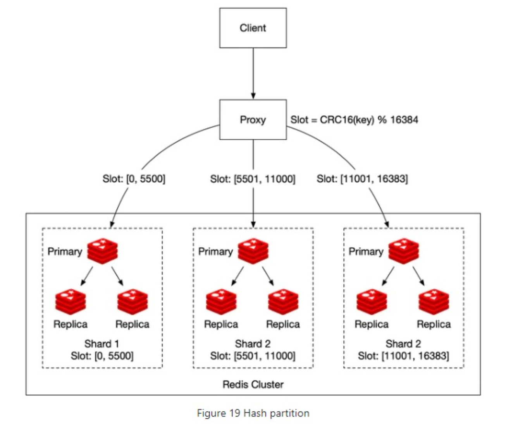

**Redis**

**Definition** key-value store where most of the data is cached useful for high throughput and low-latency applications. 

**Key properties**

**How it works**
* Snap shotting and append-only files can be used to persist data.
* Single-threaded event loop using non-blocking IO operations and avoiding concurrency problems.
* Communicate with Redis using TCP or RESP protocol
* It uses LRU to evict old data.
* Redis cluster can be used to partition data across multiple nodes
* CP (CAP) if network partition. Replication is in memory, have tunable consistency.
* Redis transactions - using `MULTI`, `EXEC`, `DISCARD` and `WATCH` commands but they only guarantee atomicity but not isolation.

**Architecture**

Sorted sets

* Redis sorted sets are atomic and have unique values in order
* Sorted sets = similar to a set but implemented with a hash table and a skip list which which are layered linked lists that allow for fast search and quick removal and deletion with O(logn) rather than O(n). Hash table mapping each element to it score. 
* Redis operations 
    * `ZADD`: insert user into set O(logn)
    * `ZINCRBY`: increment the score of user by X O(logn)
    * `ZRANGE/ZREVRANGE`: fetch or range of users by score O(log(n) + m) where m is the number of entries to fetch and n is the number of entries in the sorted set.
    * `ZRANK/ZREVRANK`: fetch the position of any user sorting in ascending/descending order in logarithmic time

Redis Cluster

* Could use fixed or hash partitions. Latter is useful for clumped data. 
* Rather than consistent hashing uses different form of sharding with hash slots. 
* However, it makes getting top 10 scores harder
* Single server is Read QPS 100k, Write QPS 100k