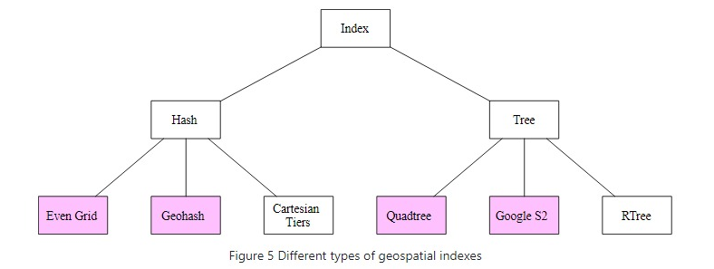
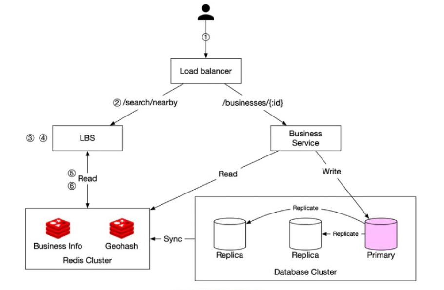

**Design a proximity service**:

**Step 1: Understand the problem and establish design scope**

Features
* User specified search radius? Yes, no expansion of radius
* Fixed and max radii? Yes
* User movement? Do not need to continuously update location
* How add business data? By businesses themselves for next day

Flows
* Search: User specifies radius and get businesses in that area including detailed information about each
* Upload: businesses upload data.

Per unit
* Low-latency
* Privacy concerns

Aggregate
* Assume 100m DAU and 200m businesses
* 100m users x 5 queries per day / 100k seconds per day = 5k QPS

Distributed systems
* Availability > Consistency
* Scalability for spike in traffic
* Read-heavy system

**Step 2: Propose high-level design and get buy-in**

APIs
* GET to search nearby with latitude, longitude and radius returning list of businesses
* GET, POST, PUT and DELETE for business info

High-level design
* Two services 1. write with business service 2. read with location-based service

Algorithms for searching
* Two-dimensional search: even if built index across longitude and latitude still need to scan entire dataset
* Hashing
    * Even grid = can lead to an index but has uneven distribution of businesses
    * Geohash = recursively divided the world into 4 quadrants, the longer the hash the greater the level of detail (12 levels) - want to use the smallest geohash that completely covers radius. Boundary problems 1. close locations can be in completely opposite grids as two different halves of the world 2. similar prefixes but different hash if on boundary. If not enough businesses just enlargen radius by removing digit of hash
* Trees
    * Quadtree = same process of dividing into four quadrants for an in-memory data structure - doesn't use much memory
    * Google S2 = map 3d-sphere to Hilbert curve which preserves closeness. It can geofence to cover arbitrary areas. 

**Step 3: Design Deep Dive**

Compute
* Scalability = Stateless
* Low-latency = it is okay to filter on open businesses after location filter because relatively small number

Data 
* Availability = Replication 
* Scalability = Sharding of business table, not because a lot of data but rather a lot of reads. For geohash data better to replica to avoid having to come up with correct sharding technique
* Low-latency = used a composite key of geohash and business id rather than just geohash and a list of businesses because then would have to scan all of them. Limited need for a cache but if so not on lat/long but instead geohash/quadtree region