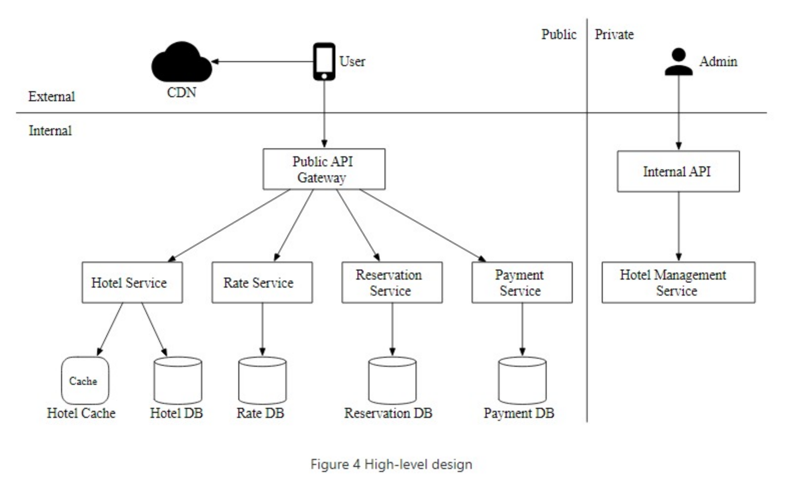

**Design a hotel reservation system**:

**Step 1: Understand the problem and establish design scope**

Features
* When pay? At reservation not at hotel
* How book? Only through website or app
* Cancel reservations? Yes
* Overbooking? Yes allow 10%
* Different pricing of rooms? Yes

Flows
* Book a room
* Cancel a room

System Design
* Scale? Lots of concurrent booking
* Latency? Moderate is okay

Estimates
* Scale? 5000 hotels and 1m rooms
* QPS: Assume 1m rooms with 70% occupancy and average stay 3 days then 1m x 0.7 / 3 = ~250k daily reservations. Per second is 250k / 100k ~ 2.5 QPS. Probably a funnel so can 10x QPS on order booking page to 25 and 10x again for hotel room detail to 250. Maybe peak is double so 500.

**Step 2: Propose high-level design and get buy-in**

Four queries
* View hotel info
* View available rooms in date range
* Record a reservation
* Look up reservation or past history or reservations

Design
* Have a service and database for each flow
* Cache where helpful

**Step 3: Design Deep Dive**

Compute
* Concurrency = add idempotency key so the same user clicking the book button multiple times won't lead to multiple bookings

Data
* Concurrency: 
    * Two separate transactions checking if available rooms remaining will both go through unless there is locking. Either use pessimistic or optimistic locking. Or use database constraints
    * If add cache then have two data systems so need to use something like Change Data Capture and Debezium to reliably read changes from one system to another system (i.e. from database to cache)
* Consistency = 
    * Rather than SQL query on booking could also retain counts - but then need to wrap in a transaction. Could use 2PC or Saga but might not be worth it. 
    * Note using true microservices for all services makes it much harder to coordinate.
* Modelling
    * Use relational database because 1. read-heavy 2. ACID for reservation 3. can model data relationships. 
    * Hotels book a type of room rather than a specific room so have `roomTypeId` and have specific `reservationId`
    * Need status field for whether payment has been confirmed or not
    * One row per date makes it easy to find availability (could be a large number of rows if do estimate)
* Low-latency = cache on current and future data for inventory. If still need to check to actually book worst case scenario is that try and fail (although inverse where don't try because think taken might happen)
* Scalability = 
    * If size of database becomes a problem only store current and future data - perhaps archive history to cold storage. 
    * Could database shard on `hotel_id`. 
