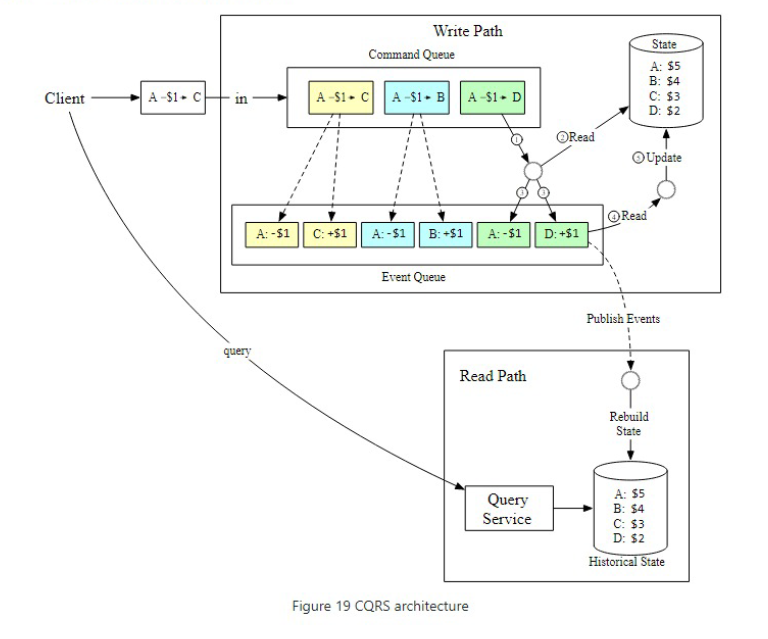
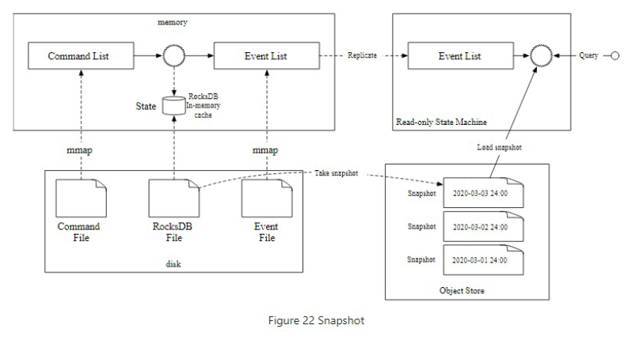
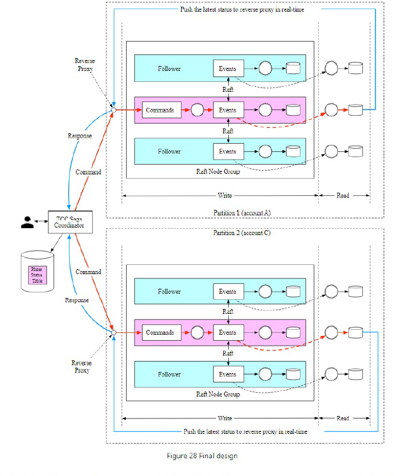

**Design a digital wallet**:

**Step 1: Understand the problem and establish design scope**

Features
* Only balance-transfer operations? Yes
* Verifiable? Don't want just differences also want to explain them
* Foreign exchange? No

Flows

Estimates
* TPS? 1m
* Relational database can support 1000 TPS but each transfer has two operations 1. deduct 2. add so need 2m / 1k = 2k nodes
System Design
* Transactional guarantees sufficFient? Yes
* Availability? 2 9s.

**Step 2: Propose high-level design and get buy-in**

Approaches
1. In-memory solution
    * Redis cluster as one node insufficient
    * Zookeeper does service discovery for the nodes and sharding 
    * Fails correctness because each transfer updates two nodes and each could fail
2. Distributed transaction with database
    * Two-phase commit 2PC: Locks on two databases for a long time a 1. prepare 2. commit - not performant
    * Try-Confirm/Cancel TC/C: Separate transactions but still try to get correct behaviour. 1. Update one account 2. update the other. If one of the updates fails then add reversing transaction. To handle failures need to store TC/C phase status in a transactional database. Valid operation order always have to deduct first (if transfering from A->B if add to B first then possible no money in A to subtract)
    * Saga: All operations are ordered in sequence, each a separate transaction. If an operation fails the entire process rolls back from the current operation in reverse order. 
3. Event sourcing solution
    * Two queues 1. command queue (what the human asks e.g. transfer $1 from A to B) 2. event queue (what the computer does under the hood e.g. -$1 from A and +$1 to B)
    * Command-query responsibility segregration (CQRS) = don't publish state publish events and allow external systems to recreate state for themselves. 

**Step 3: Design Deep Dive**

Compute
* Low-latency: Could add reverse-proxy to periodically poll status but still not real-time. Could instead push result as soon as it has it to reverse proxy
* Reliability: System is stateful and become SPOF. 

Data 
* Low-latency: Store commands to local disk via mmap rather than Kafka avoiding network time. For file-based state rather than a relational database can use either SQLite which is a file-based local relational database or use RocksDB which is a local file-based key-value store which uses a LSM under the hood. Read performance is optimized with cache
* Low-latency: create regular snapshots of state so do not need to recreate from events all the time. 
* Consistency: Eventually consistent CQRS
* Reliability: Need to replicate event list across multiple nodes using Raft consensus algorithm
