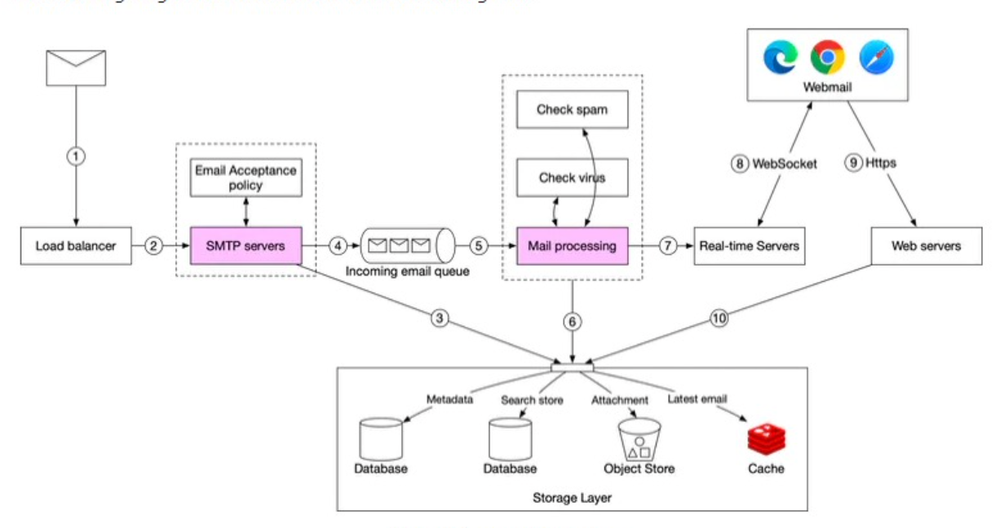

**Design Distributed Email**:

**Step 1: Understand the problem and establish design scope**

Features
* Send and receive emails
* Filter emails by read and unread status
* Search
* Authentication? No need
* Anti-spam and anti-virus
* Email attachments? Yes

Flows
* How connect? HTTP not SMTP (sending emails - to be precise sotring emails both in the sender and receivers database), POP (receiving emails - to be precise retrieving from storage both for sender and receiver -  but download entire email from server) or IMAP (only download when requested and stays on server for multiple devices)
* Send emails
* Receive emails

Estimations
* DAU? 1bn
* QPS? 1bn x 10 emails per day / 100k seconds = 100k emails per second
* Storage? Receives 30 emails per day with 50KB in email metadata. Keeping metadata for one year 1bn users x 30 emails / day x 365 x 50KB = 10^9 x 10^4 x 5x10^4 = 5 x 10^17 = 500 PB (GB 10^9 TB 10^12 PB 10^15)
* Can also do similar calculation for attachments

System Design
* Availability = shouldn't lose email data and system should respond
* Scalability = handle large user-base

**Step 2: Propose high-level design and get buy-in**

* 3 layers
    * Front-end client Gmail, Outlook etc.
    * Two flows either http for web servers or websocket for real-time servers - web sockets are not always browser compatible so can fall back to long polling
    * Storage layer of metadata, attachments, distributed cache and search store. For attachment store NoSQL not good because Cassandra practical size is only 1MB and row cache takes up too much space to use. Search store is distributed document store that supports inverted index data structure for very fast full-text searches

Email sending key thing is SMTP workers pull from a queue decoupling them to work independently

**Step 3: Design Deep Dive**
Email specific
* To avoid being classified as spam need 1. dedicated IPs 2. separate marketing emails from normal emails 3. warm up email server over time (takes 6 weeks)

Data
* Availability: Probably more important than consistency
* Modelling: We cannot perform SQL operation and it is not efficent to pull all messages into application and then filter there. Instead denormalize the data into read and unread emails.
* Scalability: NoSQL > distributed object storage and relational database. Shard data by `user_id` but then have to have multiple copies of email for each user. Partition key is `user_id` and clustering key is folder etc. 