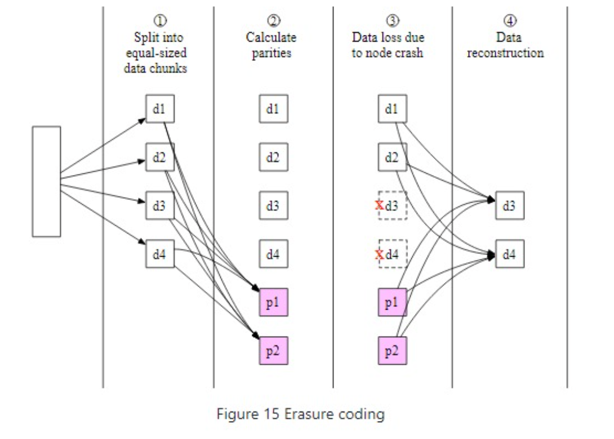
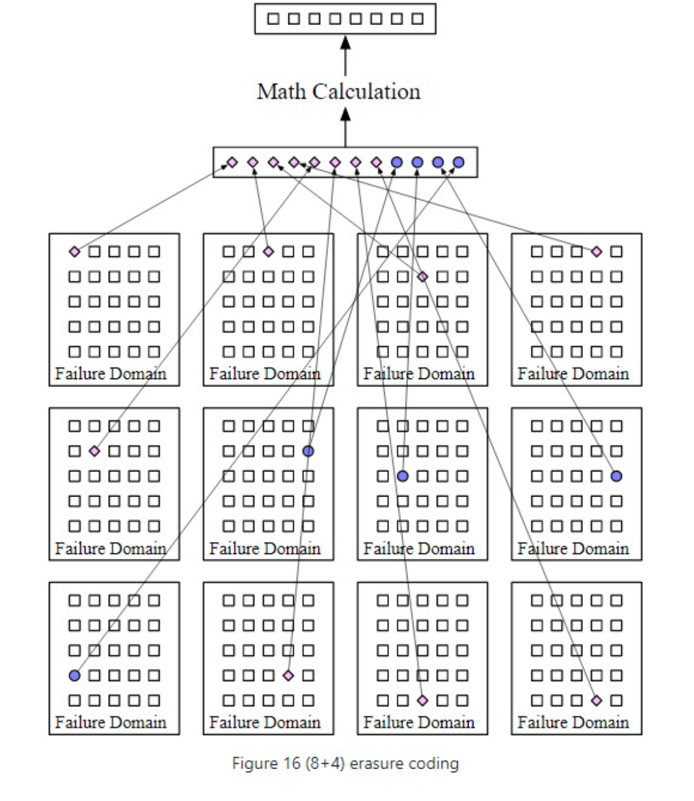

**Erasure Coding**

Advantages
* When compare to 3x replication with 6 nines of durability erasure as 11 nines (8+4).
* When compared to 200% storage overhead for 3x replication erasure coding only has a 50% overhead.

Disadvantages
* Slower and more complicated reads and writes