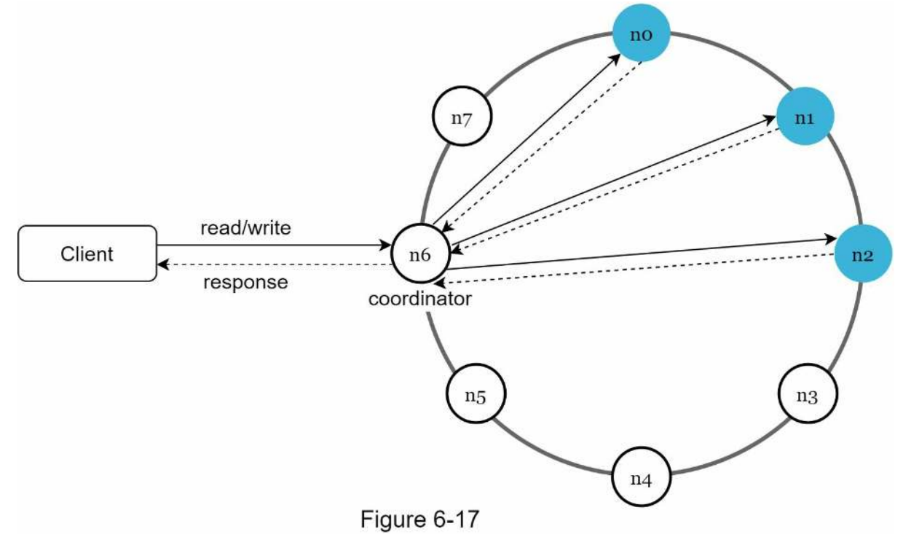

**Design a key-value store**:

**Step 1: Understand the problem and establish design scope**

Definition = non-relational database where a unique key is associated with a value. Keys are plain text or hashed values

Requirements
* Availability & scalability
* Automatic scaling
* Tunable consistency
* Low latency

**Step 2: Propose high-level design and get buy-in**

Summary: 

Notes
* Single server easy, just in memory hash-table but need a distributed key-value store for the properties above
* CAP = can only have 2 of consistency, availability and partition tolerance. In practice it is a choice between CP and AP systems

**Step 3: Design Deep Dive**

Scalability
* Data partitioning = Problems are 1. distribute data across servers evenly and 2. minimize data movement when nodes are added or removed. Solution: Consistent hashing
* Batching = can use a commit log, with a memory cache and flushing to SSTables to batch writes.

Availability
* Data replication: Replicate to first `n` servers on hash ring (physical not virtual)
* Failure detection: All-to-all server detection is inefficient, better to use a gossip protocol. 
* Temporary failures: Sloppy quorum and hinted handoff

Consistency
* Quorum consensus: read-write quorums where `W` and `R` are the number of acks needed for coordinator to consider operation successful and `N` is the number of replicas. Can tune from strong consistency with `W + R > N` to fast read and fast write where there is a latency vs consistency trade-off
* Write conflicts: pick the latest version according to server clock (typically increment)
* Permanent failures: Merkle tree for detection and synchronization
