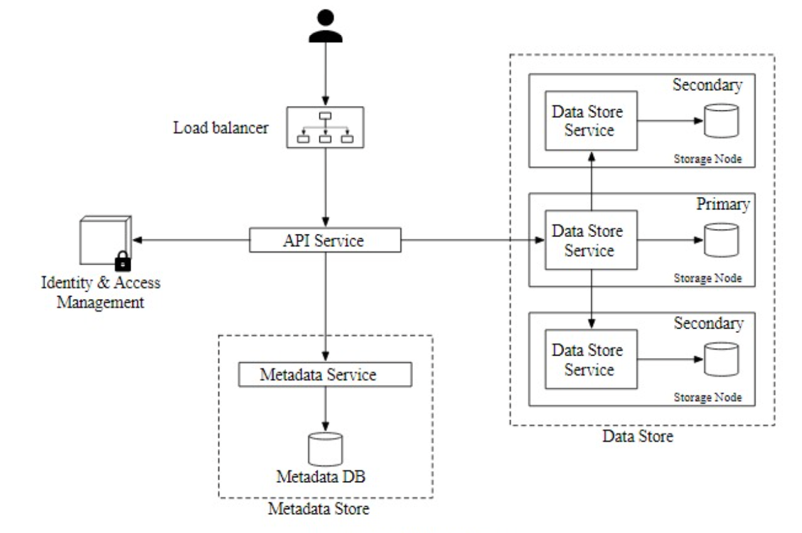
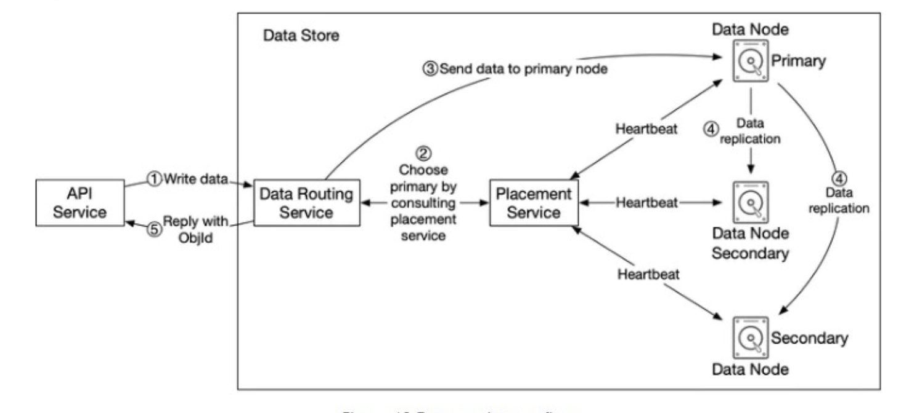

**Design a S3-like object storage**:

**Step 1: Understand the problem and establish design scope**

3 types of storage
* Block = 1960s like HDD and SDD most flexible doesn't have to be physically attached as could be over a network.
* File = built on top of block storage providing a higher-level of abstraction with files and directories. File level network protocols like SMB/CIFS and NFS can make this accessible
* Object = New and sacrifices performance for high durability, vast scala and low cost. Targeting cold data for archival and backup

Concepts
* Bucket = container for object where bucket is globally unique
* Object = individual piece of data containing payload and metadata
* Versioning = keep multiple variants of an object in the same bucket for object recovery etc.
* URI = Uniform Resource Identifier for object identification

Features
* Bucket creation
* Object uploading and downloading
* Object versioninig
* Listing objects in a bucket

Flows
* Bucket creation
* Object uploading and downloading
* Listing objects in a bucket

Estimates
* Data size? Both large objects > GBs and small objects 10s of KBs
* Data storage? 100 PB per year
* Durability? 6 9s and service availability 4 9s.
* Disk capacity = If 20% are <1MB, 60% 1-64MB and 20% > 64MB - can calculate average object size is 10MB to make maths simpler where with 100 PB = 10^17 bytes = 10^11 MB which / 10MB = 10^10 x 0.4 storage ratio is 0.4 billion objects

System Design
* High scalability 
* Latency = not important

**Step 2: Propose high-level design and get buy-in**

Overview
* Separate metadata (mutable with pointers) and object data (immutable)

**Step 3: Design Deep Dive**

Overview

Compute
* Scalability: load balancer and stateless API service

Data
* Security have IAM (identity and access management) service for authentication and authorization

Data Store

Data
* Availability: To make durable make sure to have a placement service which puts replicas in different datacentres, hosts and partitions. 
* Availability: Versioning can be supported by not updating metadata and not deleting old data.
* Consistency: In trade-off with latency choose consistency where wait for all replicas to update. 
* Consistency: To check for correctness of data can use checksum  
* Low latency: In order to have list of objects (with all the problems of sharding and pagination) instead denormalize with a separate table for list of objects.
* Scalability: Consistent hashing. 
* Scalability: Rather than many small files having their own file (which will test scalability of metadata storage and waste space) instead use a write-ahead-log type mechanism to merge data until full - although we need to serialize writes reducing concurrency.
* Scalability: Rather than simple data replication can use erasure coding which is more efficient. By chunking data into pieces and placed on different servers e.g. 8+4 erasure coding
* Scalability: for large objects slice into parts and upload separately so if fails do not lose all progress
