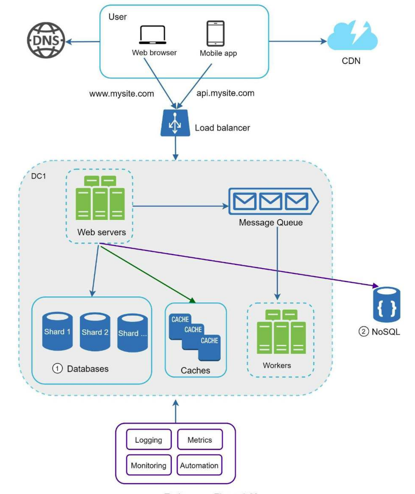

**3 goals**

* Scalability = can handle the volume of traffic required
* Availability = any client which requests data gets a response
* Consistency = all clients see the same data no matter which node they connect to

**Basic setup** 

3 parts
* User
* Web Server
* Database

**Basic answer**

4 parts
1. Understand the problem and establish design scope
2. Propose high-level design and get buy-in
3. Design deep dive 
4. Wrap

Clarifying questions
* Product
    * Features? What it should be able to do
    * Flows? Upload/download, read/write
    * Estimates? File sizes, latency, Daily active users etc, number of requests per user. ~100k seconds/day, 1bn bytes is GB
* Distributed systems
    * Compute
        * Reliability?
        * Scalability?
        * Low-latency?
        * Throughput?
    * Data
        * Availability?
        * Consistency
        * Scalability?
        * Low-latency?
    * Monitoring?