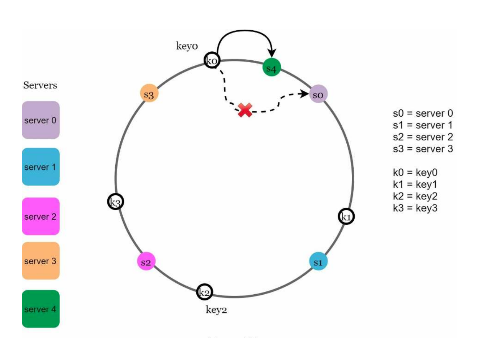

**Design Consistent Hashing**:

**Step 1: Understand the problem and establish design scope**

Definition = consistent hashing is a special kind of hashing such that when a hash table is re-sized and consistent hashing is used only `k/n` keys need to be remapped on average (where `k` is the number of keys and `n` is the number of slots), rather than all keys being re-mapped.

**Step 2: Propose high-level design and get buy-in**

Summary: Don't change the calculation, change what is done with it

Steps
* Map hash space to hash ring by connecting both ends
* Relevant server is based upon clockwise lookup
* Add/remove server so only anti-clockwise keys are remapped

**Step 3: Design Deep Dive**

Problems
* Number of keys mapped to each server won't be uniform. Solution are virtual nodes where the more nodes the more even it becomes

Extensions
* Amazon's Dynamo database partitioning